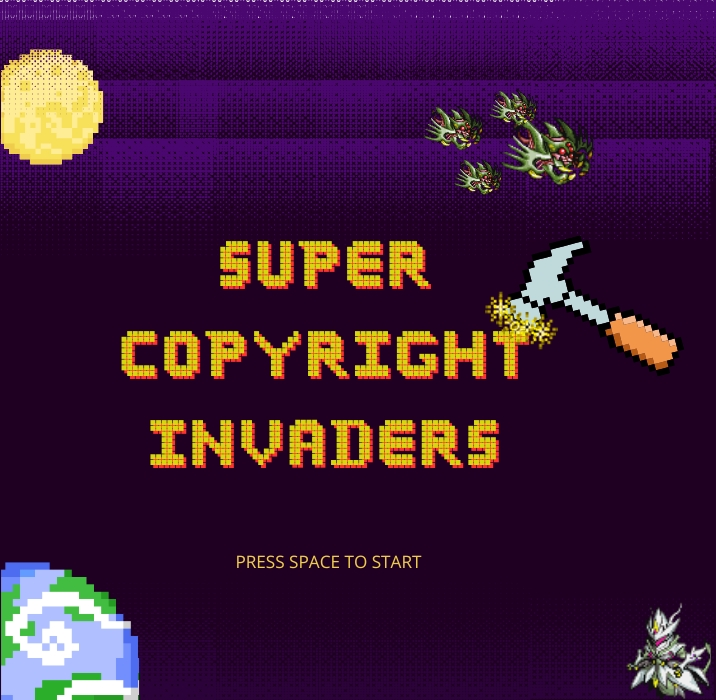
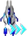
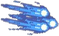
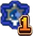
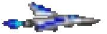
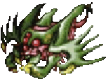
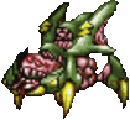
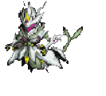
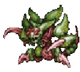

# Super Copyright Invaders.

  

A game made for our Game Dev Class Project with so much copyrighted assets from Bandai that the real threat is not the alien on the screen but the lawyers in Bandai Office. 

- Super - from Super Robot Wars ( the goated franchise, SD Gundam wish it could be )
- Copyright - .... ( Please don't sue us TwT )
- Invaders - from Space invaders the inspiration and base project of our game dev course.

## Team Members
- 6712164 - Min Khaung Kyaw Swar
- 6726129 - Lwin Pyae Aung

## Control
| Key | Action |
|---|---|
| `W` / `Up-arrow` | move up |
| `S` / `Down-arrow` | move down |
| `A` / `Left-arrow` | move back |
| `D` / `Right-arrow` | move forward |
| `Space` | shoot, and interact with menu screens |

## Powerups
| Icon | Name | Description |
|---|---|---|
|  | **Speedup** | makes your spaceship go faster..zooom zoom. ( Max: 2 ) |
|  | **Multishot** | allows you to fire faster. dzz dzz dzz ( Max: 4 ) |
|  | **Splitshot** | Summons a probe to orbit around you and shoot. Pew pew ( Max: 2 ) |
|  | **Bigshot** | Makes your shots bigger and change color. you start with a nice personality...(Max: 2) |
|  | **Heal** | Patches you back up. Not that it will save you.... |

## Story
You are a normal guy tasked to fight the radam beast invasion because ~~we~~ the department of war doesn't have the ~~budget~~ means necessary to ~~animate~~ contact tekkaman and other cool superheroes and mechs. So they said why not just send someone thats easier to get. 

Usually these beasts are called the sourge of the universe and the plague upon worlds but hey you are john, and John have nothing to live for so why not try taking out the aliens and get a nice death. 

You won't return even if you win because we can only supply you enough fuel for a oneway trip. 

Good luck have fun! 

## Characters

### Player

The ~~poor sob~~ hero that will not make it back home.

### Alien1

Normal bugs that just shoots disgusting toxins at you.

### Alien2

Spider-like bugs on a web string that goes up and down. Their toxin shots are faster.

### Mage

Goes around the map and shoots fireballs at you. ( honestly my favourite to animate )

### Mother Radam

A giant boss that have 3 phases.
- 1st phase - only shoots cresent-like claw attacks.
- 2nd phase - also normal shoot a triple split shot from their mouth.
- 3rd phase - Now also summons meteors..... Good luck!

## References
This project is based from this 
[Space Invader](https://github.com/janbodnar/Java-Space-Invaders) repository.

## Tools used
- [Canva for creating sprite sheets manually (this was a pain TwT)](https://canva.link/nv44o1h7qqe861e)
- [remove.bg to remove backgrounds from Canva sheets after saving.](https://www.remove.bg/)
- [Canva for title screen, Game Over, Game Won.](https://canva.link/14a4xawg48vh2s1)
- apple's built in CLI library to convert from other sound formats to wav.
- Level Editor with html canvas that exports to CSV.
- Python Scripts to cut and fix problematic vfx or terrains.

## Assets used
Most of the assets used in this game are from old games that I loved or ones i thought would fit in nicely with the theme of my game.

Tekkanman Late Type Ripped by Domobot from Super Robot Wars W 
- https://www.spriters-resource.com/ds_dsi/superrobotwarsw/asset/144438/ 
- Original Franchise: Tekkaman. Copyright: Tatsunoko Production and Bandai Namco Entertainment. 
- Used as Mage, with other vfx from the sheets repurposed for effects.

Radam Beast (Air) Ripped by Domobot from Super Robot Wars J 
- https://www.spriters-resource.com/game_boy_advance/srwj/asset/36948/ 
- Original Franchise: Tekkaman. Copyright: Tatsunoko Production and Bandai Namco Entertainment. 
- Used as Alien1, with other vfx from the sheets repurposed for shots and effects.

Radam Beast (Ground) Ripped by Domobot from Super Robot Wars J 
- https://www.spriters-resource.com/game_boy_advance/srwj/asset/36949/ 
- Original Franchise: Tekkaman. Copyright: Tatsunoko Production and Bandai Namco Entertainment.
- Used as Alien2.

Powerbot Ripped by Domobot from Super Robot Wars K 
- https://www.spriters-resource.com/ds_dsi/srwk/asset/164524/ 
- Original Franchise: Overman King Gainer. Copyright: Bandai Namco Entertainment.
- Used as bomb.

Vic Viper Ripped by Alekz from Salamander 
- https://www.spriters-resource.com/ds_dsi/srwk/asset/164524/ 
- Original Franchise: Salamander. Copyright: Konami.
- Used as Player.

Comet trail 
- Canva Premium Asset - Copyright:Canva
- stacked 3 for multi-shot icon 

Various other Canva Assets
- Copyright:Canva
- Used for title,Gameover,Gamewon screens

Parallax Backgrounds: Caves by [Admurin](https://admurin.itch.io/)  
- https://admurin.itch.io/parallax-backgrounds-caves
- License: CC0. 
- Used for parralax.

Super Grotoo Escape by ansimuz 
- https://ansimuz.itch.io/super-grotto-escape-pack 
- License: CC0. 
- Used for parralax and terrain.

## Music Used
NES Shooter Music (5 tracks, 3 jingles) by SketchyLogic - https://opengameart.org/content/nes-shooter-music-5-tracks-3-jingles - Licsence CC-3.0
- Mar track used for title screen,
- Mercury Track used for scene 2,
- Map (basic version) used for scene 1,
- Boss theme used for boss.
- Intro Jingle for starting game
- Warp Jingle for game over screen
- Win Jingle for game won screen.
- Venus for game story screen.

## SFX used
Laser Fire by dklon 
- https://opengameart.org/content/laser-fire 
- Licsence CC-3.0, 
- used 2 of the items here for player shoot, boss screech for 3 fire.

20 Sword Sound Effects by StarNinjas(https://opengameart.org/users/starninjas) 
- https://opengameart.org/content/20-sword-sound-effects-attacks-and-clashes 
- License CC0. 
- Used one of the options as the boss's crescent attack sfx.

10 Slime/Water Monster/Water by StarNinjas(https://opengameart.org/users/starninjas) - https://opengameart.org/content/10-slimewater-monsterwater 
- License CC0. 
- Used for alien dead explosion sound effect. 

Earth Element Magic Spell by qubodup 
- https://opengameart.org/content/earth-element-magic-spell 
- License CC0 
- used for crystal's falling down sound.

Magic SFX Sample by ViRiX Dreamcore (David Mckee) www.soundcloud.com/virix 
- https://opengameart.org/content/magic-sfx-sample 
- License CC-3.0; 
- used for mage death, and boss's summoning spell.

Insect by NoisyRedFox -- https://freesound.org/s/760564/ -- License: Creative Commons 0. 
- Used for alien's shoot effect.

Surge Leech 2 by scorpion67890 -- https://freesound.org/s/205754/ -- License: Creative Commons 0. 
- Used as Mother Radam's scream.

Beetle Squark5.wav by warrenXG -- https://freesound.org/s/502211/ -- License: Creative Commons 0. 
- Used for "intro" of aliens.

bomb_explosion_8bit by Luke.RUSTLTD(www.rustltd.com) 
- https://opengameart.org/content/bombexplosion8bit 
- License CC0. 
- Used for bomb explosion.